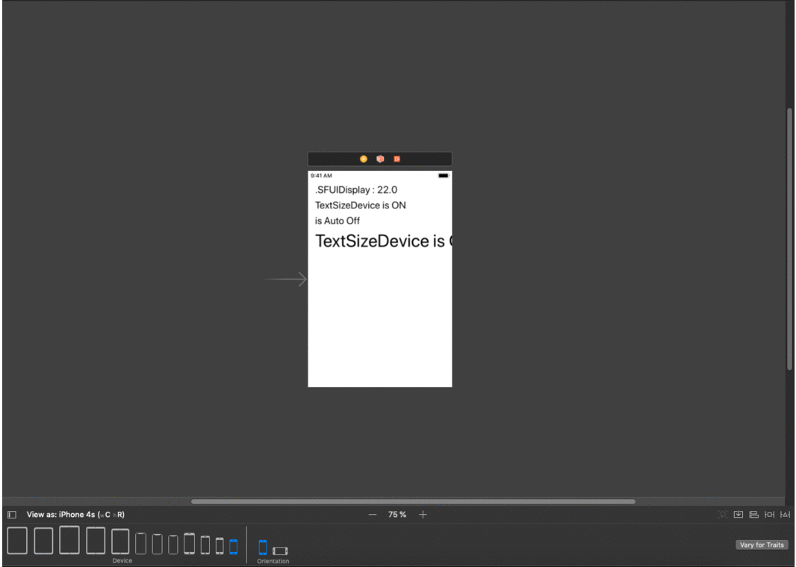
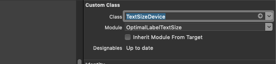
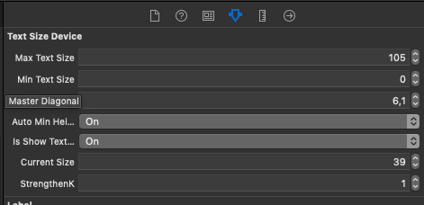

# OptimalLabelTextSize

[](https://cocoapods.org/pods/OptimalLabelTextSize)
[](https://cocoapods.org/pods/OptimalLabelTextSize)
[](https://cocoapods.org/pods/OptimalLabelTextSize)

OptimalLabelTextSize is a set of *@IBDesignable* iOS controls (label, buttons) , which have useful *@IBInspectable* properties. They allows you to build optimal size text font, see a result directly on Xcode Interface Builder.

Written on Swift


[](Images/screenshot_001.gif)

## How to use

1. Add a control (e.g. `UILabel`) onto storyboard:
2. Change the label's class to `TextSizeDevice`. Also change module to `OptimalLabelTextSize`
[](Images/screenshot_002.png)
3. Now you're able to customize the label from IB directly:
[](Images/screenshot_003.png)

Customize label have fields:
 
    1. Max Text Size : Int
        Installing max valid text Size 
        
        Default value = 17
        
    2. Min Text Size : Int
        Installing min valid text Size 
        
        Default value = 17
    
    3. Master Diagonal : CGFloat
        We point to it relatively what divece settings text size 
        
        Permissible values :
        
        "IPHONE XR" = 6,1
        
        "IPHONE X, IPHONE XS" = 5,8
        
        "IPHONE XS_MAX" = 6,5
        
        "IPHONE 5, 5S, 5C, SE" = 4,0

        "IPHONE 6,7,8 IPHONE 6S,7S,8S " = 4,7

        "IPHONE 6PLUS, 6SPLUS, 7PLUS, 8PLUS" = 5,5

        "iPad 5th Generation, iPad Retina, iPad Air, iPad Pro 9.7" = 9,7
        
        IPHONE 4,4S = 3,5
       
        "iPad Pro 10.5" = 10,5
        
        "iPad Pro 12.9" = 12,9
   
        "iPad Mini 7,9" =7,9
        
        .uknown iPhone:
        return 4.7
        
        .uknown iPad:
        return 10.5
        
        Default value = 6,1
        
    4. Auto Min Height : Bool
       value true =
            set minHeight = 9.0
            set maxHeight = currentTextSize + 3
            
        Default value = false
    
    5. is Show Text Size: Bool
       value true =
            set .text = FontName + TextSize 
    
       Default value = false
    
    
    6. StrengthenK : CGFloat
        value > 1 Reinforcing degree optimize
        value < 1 Reduces degree optimize        
        value = 1 Non - affecting optimize
        
        Default value = 1,0
        
        
        
Optimize Label or Button the programmatically

import OptimalLabelTextSize 

let k = DeviceDiagonal.getDiagonal() / DeviceSize.XR_6_1.inch
TextSizeDevice.setTextSize(with: k, currentSize: 19.0, strengthenK: 1.0, maxTextSize: 19, minTextSize: 14, label: Button.titleLabel!)
        
        


## Requirements
* Xcode 6 or above
* iOS 8 or above
* Swift 4.2 and above

## Installation

OptimalLabelTextSize is available through [CocoaPods](https://cocoapods.org). To install
it, simply add the following line to your Podfile:

```ruby
pod 'OptimalLabelTextSize'
```

## Author

snazarovone, snazarovone@icloud.com

## License

OptimalLabelTextSize is available under the MIT license. See the LICENSE file for more info.
